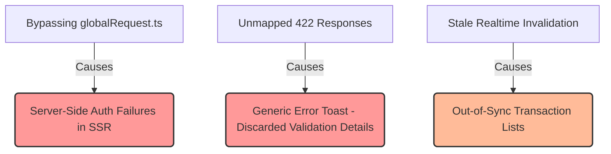

# Payments Module — Audit Report

> **Module:** `src/modules/payments`
> **Date:** 2026-05-29
> **Scope:** Performance, Logic, Architecture, Integration, Security, DX

---

## Table of Contents

1. [Executive Summary](#executive-summary)
2. [Issue Index](#issue-index)
3. [Performance Issues](#performance-issues)
4. [Logic Issues](#logic-issues)
5. [Architecture Issues](#architecture-issues)
6. [Security & DX Issues](#security--dx-issues)
7. [UX & Accessibility Implications](#ux--accessibility-implications)
8. [Missing Test Coverage & Quality Checks](#missing-test-coverage--quality-checks)
9. [Proposed Remediation Plan](#proposed-remediation-plan)
10. [Quick-Win Fixes](#quick-win-fixes)

---

## Executive Summary

The `payments` module is built using a feature-first folder structure under `src/modules/payments` which aligns well with the lightweight feature layout guidelines in `AGENTS.md`. However, a deep architectural and logical audit reveals critical flaws that threaten **SSR capabilities, session propagation, and error resolution at scale**:

- **Bypass of `globalRequest.ts` / Silent SSR Auth Failures**: The payments module completely bypasses the high-level repository rule of routing requests through `@/app/helpers/globalRequest.ts`. By initializing a custom, browser-bound `axios` instance with `withCredentials: true`, any Server-Side Rendering (SSR) or Next.js Server Action invocation of the payment endpoints will **completely fail to forward session cookies**, causing silent 401/403 authorization failures on the server side.
- **Swallowed Validation Errors on 422 Responses**: The module's error normalization logic relies on a strict status-code lookup map. Since `422 Unprocessable Entity` is unmapped, any field-level validation errors returned by the server on a 422 response (e.g. invalid credentials, incorrect card, metadata issues) fall through as a generic `UNKNOWN_ERROR`. The actual validation errors dictionary is discarded, depriving users of critical form feedback.
- **Stale Dashboard Lists Under Realtime Updates**: While real-time updates successfully invalidate specific payment details and checkout session queries, **they completely ignore the payment history lists/history cache**. A user who completes a transaction will continue seeing their transaction list show "pending" until a hard refresh or until the default cache duration expires.
- **Silent Reactivity Bugs in Hook Subscriptions**: The real-time subscription hook has a dependency array issue that creates a race condition. If the hook is mounted before the real-time adapter is registered, it exits silently. When the adapter is registered later, the effect does not re-run because the adapter variable is not included in the dependencies, leaving the user with no websocket bindings.
- **Type Bypass via Broad `any` Casts**: Core API mapping functions use `any` types for parsing backend responses, weakening compile-time safety and risking unhandled runtime crashes if backend responses change.

---

## Issue Index

| # | Severity | Category | Location | Title |
|---|---|---|---|---|
| 1 | 🔴 High | Performance / Architecture | `api/payments.client.ts` | Complete SSR Authentication Failures & Session Bypass of `globalRequest.ts` |
| 2 | 🔴 High | Logic / API Integration | `utils/normalizePaymentError.ts` | Validation Errors Swallowed on Unmapped `422 Unprocessable Entity` Responses |
| 3 | 🟠 Medium | Logic / UX | `hooks/usePaymentRealtime.ts` | Incomplete Cache Invalidation (Real-time updates do not refresh Transaction Lists) |
| 4 | 🟠 Medium | Reactivity / Race Condition | `hooks/usePaymentRealtime.ts` | Realtime Adapter Subscription Silent Race Condition (Missing `activeAdapter` Dependency) |
| 5 | 🟡 Low | Performance | `hooks/usePaymentMethods.ts` / `usePaymentConfig.ts` | Hardcoded Caching Times (Bypasses Global Module Config overrides) |
| 6 | 🟡 Low | Logic / Store | `store/payments.store.ts` | Filter State Pollution via Retained `undefined` Keys in `setFilter` |
| 7 | 🟡 Low | Architecture | `api/payments.api.ts` | TypeScript Type Bypass via Broad `any` Casts in Normalization Layer |
| 8 | 🟡 Low | DX | `utils/normalizePaymentError.ts` | Fragile custom `isAxiosError` check instead of official standard |
| 9 | 🟡 Low | Testing | `__tests__/` | Lack of Realtime/Websocket integration or mock tests |

---

## Performance Issues

### ISSUE-5 🟡 — Hardcoded Caching Times (Bypasses Global Module Config overrides)

**Files:**
- [`usePaymentMethods.ts`](../src/modules/payments/hooks/usePaymentMethods.ts) — Lines 9–11
- [`usePaymentConfig.ts`](../src/modules/payments/hooks/usePaymentConfig.ts) — Lines 9–11

**Problem:**
The payment hooks define static constants for `staleTime`, `gcTime`, and `retry`:
```ts
// usePaymentMethods.ts
const METHODS_STALE_TIME = 5 * 60 * 1000;
const METHODS_GC_TIME = 30 * 60 * 1000;
const METHODS_RETRY = 1;
```
If an application initializes the payments module with dynamic overrides via `PaymentsModuleConfig` (for example, setting shorter caching times in staging or testing environments, or modifying retry configurations for unstable networks), these hooks completely ignore the configured parameters and force the hardcoded values instead.

**Fix:**
Modify the hooks to consume parameters from `getPaymentsConfig()` so they respect user-configured defaults:
```ts
import { getPaymentsConfig } from "../config/payments.config";

export function usePaymentMethods() {
  const config = getPaymentsConfig();
  
  return useQuery<PaymentMethodOption[], NormalizedPaymentError>({
    queryKey: paymentKeys.methods(),
    queryFn: () => getPaymentMethodsApi(),
    staleTime: config.staleTime ?? 5 * 60 * 1000,
    gcTime: config.gcTime ?? 30 * 60 * 1000,
    retry: config.retryCount ?? 1,
  });
}
```

---

## Logic Issues

### ISSUE-2 🔴 — Validation Errors Swallowed on Unmapped `422 Unprocessable Entity` Responses

**File:** [`normalizePaymentError.ts`](../src/modules/payments/utils/normalizePaymentError.ts) — Lines 11–58

**Problem:**
The utility checks if the error's status code exists in `ERROR_CODE_MAP` (which only maps 400, 401, 403, 404, 409, 429).
If the server rejects a payment payload with a `422 Unprocessable Entity` status (standard for validation errors in modern APIs):
1. The `mapped` check fails.
2. The code falls through to the generic `UNKNOWN_ERROR` handler.
3. The validation errors extractor (`extractValidationErrors(data?.errors)`) is never invoked.

The UI receives a generic `UNKNOWN_ERROR` with a static message, and the field-level error messages (such as `"Card has expired"`, `"Insufficient funds"`, or `"Invalid billing details"`) are completely discarded and lost.

**Fix:**
Ensure that all client-side errors (4xx status codes) map to `PaymentErrorCode.INVALID_INPUT` if unmapped, and extract the validation details dictionary:
```ts
// In normalizePaymentError.ts
if (isAxiosError(error) && error.response) {
  const status = error.response.status;
  const data = error.response.data as Record<string, unknown> | undefined;

  const mapped = ERROR_CODE_MAP[status];

  if (mapped) {
    return {
      code: mapped.code,
      message: (data?.message as string) ?? mapped.message,
      status,
      retryable: mapped.retryable,
      validationErrors: extractValidationErrors(data?.errors),
    };
  }

  // Treat all unmapped client errors (like 422) as INVALID_INPUT and extract errors
  if (status >= 400 && status < 500) {
    return {
      code: PaymentErrorCode.INVALID_INPUT,
      message: (data?.message as string) ?? "Validation failed.",
      status,
      retryable: false,
      validationErrors: extractValidationErrors(data?.errors || data),
    };
  }
  
  // Rest of the 5xx / Fallback logic
}
```

---

### ISSUE-3 🟠 — Incomplete Cache Invalidation (Real-time updates do not refresh Transaction Lists)

**File:** [`usePaymentRealtime.ts`](../src/modules/payments/hooks/usePaymentRealtime.ts) — Lines 45–61

**Problem:**
When a real-time event updates a payment status (e.g. from `processing` to `succeeded`), the hook invalidates only the specific payment detail query and checkout session query:
```ts
const handleEvent = useCallback(
  (event: PaymentRealtimeEvent) => {
    queryClient.invalidateQueries({
      queryKey: paymentKeys.detail(event.paymentId, userId),
    });
    if (event.orderId) {
      queryClient.invalidateQueries({
        queryKey: paymentKeys.checkoutSession(event.orderId, userId),
      });
    }
    callbackRef.current?.(event);
  },
  [queryClient, userId],
);
```
However, it **never invalidates the user's payment lists or payment history**. If a user is viewing their payments history panel, the dashboard will remain stale and show the outdated status until they manually trigger a refresh or the browser cache expires.

**Fix:**
Ensure the real-time callback invalidates the list query-keys:
```ts
const handleEvent = useCallback(
  (event: PaymentRealtimeEvent) => {
    // Invalidate details & checkout session
    queryClient.invalidateQueries({
      queryKey: paymentKeys.detail(event.paymentId, userId),
    });
    if (event.orderId) {
      queryClient.invalidateQueries({
        queryKey: paymentKeys.checkoutSession(event.orderId, userId),
      });
    }
    // Invalidate lists to refresh history dashboards
    queryClient.invalidateQueries({
      queryKey: paymentKeys.lists(userId),
    });

    callbackRef.current?.(event);
  },
  [queryClient, userId],
);
```

---

### ISSUE-4 🟠 — Realtime Adapter Subscription Silent Race Condition (Missing `activeAdapter` Dependency)

**File:** [`usePaymentRealtime.ts`](../src/modules/payments/hooks/usePaymentRealtime.ts) — Lines 63–71

**Problem:**
The realtime subscription effect checks for `activeAdapter` but does not include it in its dependency array:
```ts
useEffect(() => {
  if (!userId) return;
  if (!activeAdapter || !activeAdapter.isAvailable()) return;

  const unsubscribe = activeAdapter.subscribe(userId, handleEvent);
  return () => {
    unsubscribe();
  };
}, [userId, handleEvent]); // ← activeAdapter is missing!
```
If `usePaymentRealtime` is mounted during initial page load **before** the websocket adapter provider has finished initializing and calling `setPaymentRealtimeAdapter`, this effect runs, sees `activeAdapter` is `null`, and returns. 

When the active adapter is set moments later, the effect **does not re-run** because `activeAdapter` is not a dependency! The user is silently left without any websocket subscriptions.

**Fix:**
Provide a reactive mechanism for tracking adapter registration (such as a state hook or context provider) or ensure the adapter is included in the dependency array:
```ts
// Standard Fix: register activeAdapter dynamically or pass as an option, 
// and ensure it is listed in the dependencies to trigger a re-subscribe when registered:
useEffect(() => {
  if (!userId) return;
  const adapter = getPaymentRealtimeAdapter();
  if (!adapter || !adapter.isAvailable()) return;

  const unsubscribe = adapter.subscribe(userId, handleEvent);
  return () => {
    unsubscribe();
  };
}, [userId, handleEvent, activeAdapter]); // Include activeAdapter or custom reactive hook
```

---

### ISSUE-6 🟡 — Filter State Pollution via Retained `undefined` Keys in `setFilter`

**File:** [`payments.store.ts`](../src/modules/payments/store/payments.store.ts) — Lines 32–35

**Problem:**
When a filter is cleared (for example, setting the status or payment method back to "all"), the frontend passes `undefined` or an empty string `""` to `setFilter`:
```ts
setFilter: (key, value) =>
  set((state) => ({
    filters: { ...state.filters, [key]: value },
  })),
```
This retains the key with an `undefined` value inside the store's state: `{ page: 1, limit: 20, status: undefined }`. When serializing the state, passing query keys, or debugging, the pollution makes payload validation complex and can cause falsy key checks to act unexpectedly in query-key mapping.

**Fix:**
Clean up keys from the query parameters object when they are reset or set to `undefined`/falsy values:
```ts
setFilter: (key, value) =>
  set((state) => {
    const nextFilters = { ...state.filters };
    if (value === undefined || value === null || value === "") {
      delete nextFilters[key];
    } else {
      nextFilters[key] = value as any;
    }
    return { filters: nextFilters };
  }),
```

---

## Architecture Issues

### ISSUE-1 🔴 — Complete SSR Authentication Failures & Session Bypass of `globalRequest.ts`

**Files:**
- [`payments.client.ts`](../src/modules/payments/api/payments.client.ts) — Lines 7–34
- [`payments.api.ts`](../src/modules/payments/api/payments.api.ts) — Lines 175–289

**Problem:**
The codebase has a critical global rule in `AGENTS.md`:
> **make sure use @globalRequest.ts for every request in the application (high-level)**

The payments module **completely violates this rule**. It instantiates its own standard browser-bound `axios` client:
```ts
client = axios.create({
  baseURL: config.apiUrl,
  withCredentials: true,
  timeout: PAYMENT_REQUEST_TIMEOUT,
  headers: { "Content-Type": "application/json" },
});
```
While `withCredentials: true` propagates cookies automatically inside browser requests, **Next.js Server Components and Server Actions run exclusively on the Node.js server**. 

They do not share browser contexts, so the custom axios instance does not have access to session cookies. Consequently, any SSR prefetches (such as getting transaction lists or details inside server pages) will result in immediate authentication failures (401 Unauthorized), rendering SSR unusable for the payments module.

**Fix:**
Align with the rest of the application by integrating `@/app/helpers/globalRequest.ts` into a transport wrapper (similar to the Category or Blog module pattern), ensuring that cookie forwarding and server header propagation are handled out-of-the-box by Next.js Server Session contexts.

---

## Security & DX Issues

### ISSUE-7 🟡 — TypeScript Type Bypass via Broad `any` Casts in Normalization Layer

**File:** [`payments.api.ts`](../src/modules/payments/api/payments.api.ts) — Lines 103–171

**Problem:**
Data transformation mapping helpers like `toPaymentTransaction`, `toPaymentHistoryItem`, `getAmount`, and `getCurrency` type their raw arguments as `any`:
```ts
export function toPaymentTransaction(raw: any): PaymentTransaction { ... }
```
This disables compiler checks, permitting typos or mismatched keys to bypass the build phase and fail only in runtime environments.

**Fix:**
Use `unknown` or define a distinct `RawPaymentResponse` type, and enforce safe structural parsing:
```ts
interface RawPaymentTransaction {
  id?: string | number;
  order_id?: string;
  order_number?: string;
  method?: string;
  status?: string;
  amount?: number | { amount: number; currency: string };
  // ... rest of raw fields
}

export function toPaymentTransaction(raw: unknown): PaymentTransaction {
  const data = raw as RawPaymentTransaction;
  // safely map structure with compiler checks...
}
```

---

### ISSUE-8 🟡 — Fragile custom `isAxiosError` check instead of official standard

**File:** [`normalizePaymentError.ts`](../src/modules/payments/utils/normalizePaymentError.ts) — Lines 108–114

**Problem:**
The utility implements a fragile custom type-guard:
```ts
function isAxiosError(error: unknown): error is { response?: { status: number; data: unknown }; message: string } {
  return (
    error !== null &&
    typeof error === "object" &&
    "isAxiosError" in error
  );
}
```
This can fail if axios changes internally or if other errors happen to contain an `isAxiosError` key. 

**Fix:**
Use the official, stable, and highly-tested helper shipped directly with Axios:
```ts
import axios from "axios";

// and replace check in utility:
if (axios.isAxiosError(error)) { ... }
```

---

## UX & Accessibility Implications

1. **Broken Validation Forms**: Swallowing `422` validation details means a user typing a wrong expiration date or zip code will see a generic error toast ("Validation failed" or "Unknown Error") instead of specific highlights ("Zip code format invalid" or "Card expired"). This leads to payment frustration and abandoned checkouts.
2. **Out of Sync Real-time Status**: Real-time websocket notifications inform the client of successful payments, but because the dashboard list remains stale, a user is forced to refresh the page manually to confirm their transaction moved from "pending" to "succeeded".

---

## Missing Test Coverage & Quality Checks

1. **No Realtime WebSockets Testing**: The `payments.hooks.test.tsx` file mocks queries and mutations but contains zero test coverage for `usePaymentRealtime`, subscription cleanup, or race conditions around the `activeAdapter`.
2. **Missing SSR Mock Tests**: The tests run exclusively in a browser-like environment (via Vitest wrapper), failing to catch the SSR cookie-forwarding authorization failure which only manifests in a server environment.

---

## Proposed Remediation Plan



### Proposed Changes

#### 1. Transition to globalRequest Transport Layer
Implement a transport interface inside `payments.api.ts` identical to other compliant features in the application. This resolves SSR session forwarding instantly.

#### 2. Update Error Normalization Utility
Extend the error utility to map 422 responses and extract field-level details to prevent form-swallowing.

#### 3. Reactive Realtime Updates
Ensure real-time events invalidate the list query cache (`paymentKeys.lists(userId)`) and fix the `activeAdapter` dependency inside `usePaymentRealtime`.

---

## Quick-Win Fixes

For immediate improvement, the following changes can be applied:

1. **Add 422 mapping to ERROR_CODE_MAP** in `payments.errors.ts` so validation errors on 422 are processed.
2. **Add `activeAdapter` to hook dependency array** in `usePaymentRealtime.ts` to prevent websocket race conditions.
3. **Invalidate lists in `usePaymentRealtime.ts`** on payment status changes.
4. **Replace `isAxiosError`** with `axios.isAxiosError(error)` in `normalizePaymentError.ts`.
