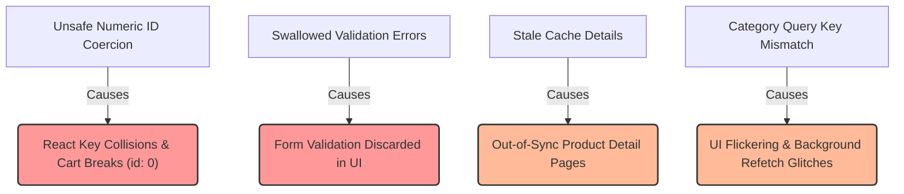

# Products Module — Audit Report

> **Module:** `src/modules/products`  
> **Date:** 2026-05-29  
> **Scope:** Performance, Logic, Architecture, Integration, Type Safety, DX  

---

## Table of Contents

1. [Executive Summary](#executive-summary)
2. [Issue Index](#issue-index)
3. [Performance Issues](#performance-issues)
4. [Logic Issues](#logic-issues)
5. [Architecture Issues](#architecture-issues)
6. [Security, DX & Type Safety Issues](#security-dx--type-safety-issues)
7. [UX & Accessibility Implications](#ux--accessibility-implications)
8. [Missing Test Coverage & Quality Checks](#missing-test-coverage--quality-checks)
9. [Proposed Remediation Plan](#proposed-remediation-plan)
10. [Quick-Win Fixes](#quick-win-fixes)

---

## Executive Summary

The `products` module is built using a feature-first folder structure under `src/modules/products`, which aligns well with the lightweight feature layout guidelines specified in `AGENTS.md`. However, a deep architectural, logical, and code-level audit reveals several critical issues that threaten **legacy UI integration, error handling accuracy, public-facing caching consistency, and server-side prefetching**:

*   **Critical Legacy Collision (Unsafe ID Coercion)**: The `productToLegacy` adapter coerces string IDs directly to numbers using `Number(product.id) || 0`. If the backend serves non-numeric string IDs (such as UUIDs), this coerces all product IDs to `0`. Consequently, React key bindings will collide, triggering massive rendering glitches, node recycling failures, and completely breaking cart/checkout actions in legacy components.
*   **Swallowed Validation Errors on Backend Responses**: The base `productsRequest` utility discards `res.errors` when throwing failed API responses. The UI form handlers are left with only a generic error message, completely depriving users of crucial field-level validation feedback (e.g., duplicate SKU, invalid price formats, missing required fields).
*   **Cache Invalidation Gaps in Mutation Hooks**: The mutation hooks (`useUpdateProduct`, `useToggleProductPublish`, and `useDeleteProduct`) omit key invalidations on successful mutations. The public detail pages (`productKeys.detail(slug)`) and all general detail entries (`productKeys.details()`) are ignored, causing users to see stale details or deleted/unpublished products in cached states.
*   **Mismatched Query Keys & Endpoints in Category Prefetching**: The server prefetcher `prefetchProductsByCategory` caches queries using the general list key `productKeys.list({ ...query, categorySlug })` but executes a category-specific endpoint (`/api/products/category/${categorySlug}`). Since there is no `useProductsByCategory` hook on the client side, client-side category pages invoke `useProducts({ categorySlug })` instead, causing a query-endpoint mismatch under the same cache key. React Query will serve cached data from the prefetch but subsequently run a background refetch hitting `/api/products?categorySlug=...`, causing visual flickering, jumps, or data inconsistencies.
*   **Hardcoded Cache Configuration**: Caching times (`staleTime`, `gcTime`) and retry limits are statically hardcoded to default constants, rendering custom module configurations initialized via `configureProducts(...)` entirely ignored in client components.

---

## Issue Index

| # | Severity | Category | Location | Title |
|---|---|---|---|---|
| 1 | 🔴 High | Logic / UI Adapter | `adapters/productToLegacy.ts` | Critical Legacy ID Collision and NaN Coercion Fallback |
| 2 | 🔴 High | Logic / Error Handling | `api/products.api.ts` | Swallowed Field-Level Validation Errors in `productsRequest` |
| 3 | 🟠 Medium | Cache Invalidation | `hooks/useUpdateProduct.ts` <br>`useToggleProductPublish.ts` <br>`useDeleteProduct.ts` | Public Detail Cache Invalidation Gaps in Product Mutations |
| 4 | 🟠 Medium | Architecture / SSR | `server/prefetchProducts.ts` <br>`hooks/useProducts.ts` | Mismatched Query Keys and Endpoint Usage in Category Prefetching |
| 5 | 🟡 Low | Performance | `hooks/` (Query hooks) | Hardcoded Caching Configurations Bypassing Module Config overrides |
| 6 | 🟡 Low | Logic / Stability | `hooks/useProduct.ts` | Fragile Input Handling and Blank Slug API Invocations in `useProduct` |
| 7 | 🟡 Low | Type Safety | `api/products.api.ts` | Type Bypass via Broad `any` Casts at Network/Normalization Boundaries |
| 8 | 🟡 Low | Testing | `__tests__/` | Complete Lack of Hook Integration and Server Prefetching Test Coverage |

---

## Performance Issues

### ISSUE-5 🟡 — Hardcoded Caching Configurations Bypassing Module Config overrides

**Files:**
*   [`useProducts.ts`](../src/modules/products/hooks/useProducts.ts) — Lines 14–16
*   [`useProduct.ts`](../src/modules/products/hooks/useProduct.ts) — Lines 14–16
*   [`useAdminProducts.ts`](../src/modules/products/hooks/useAdminProducts.ts) — Lines 17–19

**Problem:**  
The product querying hooks define their caching properties using static properties loaded directly from `PRODUCTS_DEFAULTS`:
```ts
// useProducts.ts
staleTime: PRODUCTS_DEFAULTS.STALE_TIME,
gcTime: PRODUCTS_DEFAULTS.GC_TIME,
retry: PRODUCTS_DEFAULTS.RETRY,
```
If the parent application configures the products module with customized behavior (for example, setting short caching times in development/testing, or raising/lowering query retries based on connection stability), these React Query hooks completely ignore the customized properties because `ProductsConfig` lacks caching definitions and the hooks lack dynamic config integration.

**Fix:**  
1. Extend the `ProductsConfig` interface in `products.config.ts` to support caching overrides.
2. Update the hooks to query `getProductsConfig()` and dynamically assign the values.

*Before-and-After Example:*
```diff
// src/modules/products/config/products.config.ts
 export interface ProductsConfig {
   baseURL: string;
   onUnauthorized?: () => void;
+  staleTime?: number;
+  gcTime?: number;
+  retryCount?: number;
 }
```

```diff
// src/modules/products/hooks/useProducts.ts
+import { getProductsConfig } from "../config/products.config";
 
 export function useProducts(query?: ProductQuery) {
+  const config = getProductsConfig();
   return useQuery<PaginatedResult<Product>>({
     queryKey: productKeys.list(query),
     queryFn: () => getProductsApi(query),
-    staleTime: PRODUCTS_DEFAULTS.STALE_TIME,
-    gcTime: PRODUCTS_DEFAULTS.GC_TIME,
-    retry: PRODUCTS_DEFAULTS.RETRY,
+    staleTime: config.staleTime ?? PRODUCTS_DEFAULTS.STALE_TIME,
+    gcTime: config.gcTime ?? PRODUCTS_DEFAULTS.GC_TIME,
+    retry: config.retryCount ?? PRODUCTS_DEFAULTS.RETRY,
   });
 }
```

---

## Logic Issues

### ISSUE-1 🔴 — Critical Legacy ID Collision and NaN Coercion Fallback

**File:** [`productToLegacy.ts`](../src/modules/products/adapters/productToLegacy.ts) — Line 11

**Problem:**  
The legacy adapter maps the product ID by wrapping it in `Number()`:
```ts
id: Number(product.id) || 0,
```
Modern database engines frequently leverage UUIDs (`string`-based hashes like `"b4f91c93-..."`) rather than incremental integers for product identifiers. Because a UUID cannot be coerced to a number, `Number(product.id)` yields `NaN`, causing the expression to fall back to `0`.  
If multiple products in a list are mapped via this adapter, they will all receive `id: 0`. This triggers:
1.  **React Rendering Errors**: Key collisions on rendering lists (duplicate `key={product.id}` keys).
2.  **State Contamination**: Legacy UI operations (such as checking if a product is in a cart by checking matching product IDs, clicking detail links, or comparing items) will either target the wrong product or act on all products with ID `0` simultaneously.

**Fix:**  
Ideally, the legacy typings should be refactored to allow `string | number` as the identifier type. If the legacy components strictly demand a `number`, we should deterministic-hash non-numeric strings to positive integers so that products maintain unique legacy IDs:

```ts
export function productToLegacy(product: Product): ProductType {
  const parsedId = Number(product.id);
  const safeId = !isNaN(parsedId)
    ? parsedId
    : product.id.split("").reduce((acc, char) => {
        // Simple deterministic hash to integer
        const hash = (acc << 5) - acc + char.charCodeAt(0);
        return Math.abs(hash & hash);
      }, 0);

  return {
    id: safeId,
    title: product.title,
    // ...
```

---

### ISSUE-2 🔴 — Swallowed Field-Level Validation Errors in `productsRequest`

**File:** [`products.api.ts`](../src/modules/products/api/products.api.ts) — Lines 35–37

**Problem:**  
In `productsRequest`, when `globalRequest` signals a failure, an error is thrown to be intercepted by React Query:
```ts
  if (!res.success) {
    throw { message: res.message, status: res.statusCode ?? 500 } satisfies ApiError;
  }
```
`globalRequest` extracts and populates field-level validation errors under `res.errors` (of type `Record<string, string[]>`). However, `productsRequest` completely drops the `res.errors` object.  
As a result:
*   Calling mutation hooks (like `useCreateProduct` or `useUpdateProduct`) receive an error that lacks the `errors` array.
*   Forms cannot render custom, inline field-level errors (e.g. *"SKU is already in use"*, *"Discount percentage cannot exceed 100%"*).
*   Users are left with only a generic message, reducing usability.

**Fix:**  
Create a utility function to safely translate `Record<string, string[]>` errors into the `ValidationErrorItem[]` array shape expected by `ApiError`, and forward it in the thrown object:

```ts
function parseValidationErrors(
  errors?: Record<string, string[]>,
): ValidationErrorItem[] | undefined {
  if (!errors) return undefined;
  return Object.entries(errors).flatMap(([field, messages]) =>
    messages.map((message) => ({ field, message })),
  );
}

async function productsRequest<TResult = any>(
  endpoint: string,
  method: "GET" | "POST" | "PATCH" | "PUT" | "DELETE" = "GET",
  body?: unknown,
): Promise<TResult> {
  const { baseURL } = getProductsConfig();
  const res = await globalRequest({
    endpoint,
    method,
    body,
    ...(baseURL ? { baseURL } : {}),
  });
  if (!res.success) {
    throw {
      message: res.message,
      status: res.statusCode ?? 500,
      errors: parseValidationErrors(res.errors),
    } satisfies ApiError;
  }
  return res.data as TResult;
}
```

---

### ISSUE-3 🟠 — Public Detail Cache Invalidation Gaps in Product Mutations

**Files:**
*   [`useUpdateProduct.ts`](../src/modules/products/hooks/useUpdateProduct.ts) — Lines 18–25
*   [`useToggleProductPublish.ts`](../src/modules/products/hooks/useToggleProductPublish.ts) — Lines 13–17
*   [`useDeleteProduct.ts`](../src/modules/products/hooks/useDeleteProduct.ts) — Lines 13–20

**Problem:**  
When mutations succeed, they perform partial cache invalidation:
*   `useUpdateProduct` invalidates `lists()`, `adminLists()`, and `adminDetail(id)`. **It neglects `detail(slug)`**.
*   `useToggleProductPublish` invalidates `adminLists` and `lists()`. **It neglects `adminDetail(id)`, `detail(slug)`, and `details()`**.
*   `useDeleteProduct` invalidates `adminLists()`, `lists()`, and `adminDetails()`. **It neglects `details()` (the public details query key)**.

Consequently:
1.  If an administrator edits a product's price, the public detail page (cached by React Query under `productKeys.detail(slug)`) will continue to serve the outdated price until the browser cache naturally expires or is force-refreshed.
2.  If an administrator unpublishes or deletes a product, a customer hitting the cached public URL directly will still view the active product detail page instead of encountering the appropriate error/not found screen.

**Fix:**  
Ensure that successful mutations invalidate the complete details sub-tree or the exact target slug keys:

```ts
// In useUpdateProduct.ts
    onSuccess: (data, { id }) => {
      queryClient.invalidateQueries({ queryKey: productKeys.lists() });
      queryClient.invalidateQueries({ queryKey: productKeys.adminLists() });
      queryClient.invalidateQueries({ queryKey: productKeys.adminDetail(id) });
      if (data?.slug) {
        queryClient.invalidateQueries({ queryKey: productKeys.detail(data.slug) });
      }
      queryClient.invalidateQueries({ queryKey: productKeys.details() });
    }
```

```ts
// In useToggleProductPublish.ts
    onSuccess: (_, id) => {
      queryClient.invalidateQueries({ queryKey: productKeys.adminLists() });
      queryClient.invalidateQueries({ queryKey: productKeys.lists() });
      queryClient.invalidateQueries({ queryKey: productKeys.adminDetail(id) });
      queryClient.invalidateQueries({ queryKey: productKeys.details() });
    }
```

```ts
// In useDeleteProduct.ts
    onSuccess: () => {
      queryClient.invalidateQueries({ queryKey: productKeys.adminLists() });
      queryClient.invalidateQueries({ queryKey: productKeys.lists() });
      queryClient.invalidateQueries({ queryKey: productKeys.adminDetails() });
      queryClient.invalidateQueries({ queryKey: productKeys.details() });
    }
```

---

### ISSUE-6 🟡 — Fragile Input Handling and Blank Slug API Invocations in `useProduct`

**File:** [`useProduct.ts`](../src/modules/products/hooks/useProduct.ts) — Lines 9–17

**Problem:**  
The hook maps `slug` with raw fallbacks:
```ts
export function useProduct(slug: string | undefined) {
  return useQuery<Product>({
    queryKey: productKeys.detail(slug ?? ""),
    queryFn: () => getProductApi(slug!),
    enabled: !!slug,
```
If `slug` is `undefined`, `enabled` is set to `false`, preventing automatic fetches on mounting. However, if code triggers a manual `refetch()` or if TanStack Query runs a global refetch on window re-focus, the query function is invoked. The forced assertion `slug!` evaluates to `undefined`, calling `/api/products/` (blank slug).  
This hits the public list endpoint, retrieving a paginated lists array instead of a single product object, leading to type-casting failures or silent structural breaks when mapped.

**Fix:**  
Validate the slug's existence inside both `enabled` and the query function block:

```ts
export function useProduct(slug: string | undefined) {
  const config = getProductsConfig();
  const safeSlug = slug?.trim() || "";

  return useQuery<Product>({
    queryKey: productKeys.detail(safeSlug),
    queryFn: () => {
      if (!safeSlug) {
        throw new Error("Product slug is required.");
      }
      return getProductApi(safeSlug);
    },
    enabled: safeSlug.length > 0,
    staleTime: config.staleTime ?? PRODUCTS_DEFAULTS.STALE_TIME,
    gcTime: config.gcTime ?? PRODUCTS_DEFAULTS.GC_TIME,
    retry: config.retryCount ?? PRODUCTS_DEFAULTS.RETRY,
  });
}
```

---

## Architecture Issues

### ISSUE-4 🟠 — Mismatched Query Keys and Endpoint Usage in Category Prefetching

**Files:**
*   [`prefetchProducts.ts`](../src/modules/products/server/prefetchProducts.ts) — Line 24
*   [`useProducts.ts`](../src/modules/products/hooks/useProducts.ts)

**Problem:**  
In `prefetchProducts.ts`, the server-side utility `prefetchProductsByCategory` pre-fetches and registers cache records using:
```ts
queryKey: productKeys.list({ ...query, categorySlug }),
queryFn: () => getProductsByCategoryApi(categorySlug, query),
```
This hits `/api/products/category/${categorySlug}`.  
However, on the client side, there is **no** category-specific hook. To show products matching a category, client components must invoke the standard:
```ts
useProducts({ categorySlug: "laptops" });
```
This registers the exact same query key (`productKeys.list({ categorySlug: "laptops" })`), but runs the general query function `() => getProductsApi(query)`, which maps to `/api/products?categorySlug=laptops`.

This creates a severe **query key mismatch** between the server and the client under the exact same cache identifier:
1.  The server fetches the page via `/api/products/category/laptops` and writes it to the prefetch cache.
2.  The client mounts and initially serves the prefetched HTML (SSR).
3.  Once dehydrated, React Query sees that the cache key matches.
4.  As soon as the cache becomes stale or a background refetch triggers (window focus, scrolling, network reconnection), React Query runs the client query function, hitting `/api/products?categorySlug=laptops` instead.
5.  If the backend serializes pagination, sorting, or structural data differently for these two endpoints, this will trigger sudden UI layout jumps, missing products, or unhandled component rendering exceptions.

**Fix:**  
Align the endpoints and query keys. The best approach is to expose a dedicated client-side hook `useProductsByCategory` that mirrors the exact behavior and query key structure of the prefetcher:

```ts
// 1. In index.ts, export the new hook:
export { useProductsByCategory } from "./hooks/useProductsByCategory";

// 2. Create hooks/useProductsByCategory.ts:
import { useQuery } from "@tanstack/react-query";
import { getProductsByCategoryApi } from "../api/products.api";
import { productKeys } from "../constants/products.keys";
import { getProductsConfig } from "../config/products.config";
import { PRODUCTS_DEFAULTS } from "../constants/products.defaults";
import type { Product } from "../types/product.types";
import type { ProductQuery, PaginatedResult } from "../types/product-dto.types";

export function useProductsByCategory(categorySlug: string, query?: ProductQuery) {
  const config = getProductsConfig();
  return useQuery<PaginatedResult<Product>>({
    // Use a distinct key sub-path to isolate category endpoints from general lists
    queryKey: [...productKeys.lists(), "category", categorySlug, query ?? {}] as const,
    queryFn: () => getProductsByCategoryApi(categorySlug, query),
    staleTime: config.staleTime ?? PRODUCTS_DEFAULTS.STALE_TIME,
    gcTime: config.gcTime ?? PRODUCTS_DEFAULTS.GC_TIME,
    retry: config.retryCount ?? PRODUCTS_DEFAULTS.RETRY,
  });
}
```

---

## Security, DX & Type Safety Issues

### ISSUE-7 🟡 — Type Bypass via Broad `any` Casts at Network/Normalization Boundaries

**File:** [`products.api.ts`](../src/modules/products/api/products.api.ts)

**Problem:**  
In `products.api.ts`, the shared fetcher defaults to `any`:
```ts
async function productsRequest<TResult = any>(...)
```
Additionally, all raw request calls inside `getProductsApi`, `getProductApi`, and mutations pass `any` as their target parameters:
```ts
const raw = await productsRequest<any>(`${PRODUCTS_ENDPOINTS.PUBLIC_LIST}${qs}`);
```
This forces TypeScript to disable compilation checks. If the backend schema changes or returns an unexpected object (e.g., changing `{ data: [...] }` to `{ products: [...] }`), the compiler cannot warn us, leading directly to silent runtime breaks inside `normalizeProductPayload`.

**Fix:**  
Define strict TypeScript interfaces representing the raw shapes coming from the network, and use them inside `productsRequest` invocations:

```ts
// Define Raw Response DTOs
export interface RawProductsListResponse {
  data?: RawProductPayload[];
  products?: RawProductPayload[];
  pagination?: Record<string, unknown>;
}

// In products.api.ts:
export async function getProductsApi(
  query?: ProductQuery,
): Promise<PaginatedResult<Product>> {
  const qs = query ? buildQueryString(serializeProductQuery(query)) : "";
  const raw = await productsRequest<RawProductsListResponse>(
    `${PRODUCTS_ENDPOINTS.PUBLIC_LIST}${qs}`,
  );
  const items = raw.data ?? raw.products ?? [];
  return {
    data: items.map((rawItem) => normalizeProductPayload(rawItem)),
    pagination: coercePagination(raw.pagination ?? raw),
  };
}
```

---

## UX & Accessibility Implications

1.  **Broken Form Validation**: Discarding backend validation errors at the network layer prevents forms from displaying specific input-level error messages (e.g. *"This SKU is already registered"*). Users receive a generic error toast ("Please check the form for errors"), forcing them to guess which inputs are invalid.
2.  **Stale Product Detail UI**: Gaps in cache invalidations cause customers to see outdated prices or product descriptions even after modifications are submitted by administrators.
3.  **Deleted Products Visible**: Missing invalidations for public queries during deletion allow cached product detail pages to remain visible to active site visitors, leading to unexpected checkout failures if they try to purchase deleted items.

---

## Missing Test Coverage & Quality Checks

The unit tests inside `__tests__/` are strictly focused on transformers and validator rules:
*   `products-mapper.test.ts`
*   `products-pricing.test.ts`
*   `products-query-mapper.test.ts`
*   `products-slug.test.ts`
*   `products-validators.test.ts`

**There is a complete lack of automated test coverage for:**
1.  **React Query Hooks**: No hook tests using `@testing-library/react-hooks` or similar test setups to verify states (loading, success, error), enabled triggers, or invalidation sequences.
2.  **Server Prefetching**: No unit or integration testing for `prefetchProduct` or `prefetchProducts` to guarantee correct server rendering initialization.
3.  **Legacy Adapters**: No test coverage for `productToLegacy.ts` mapping or safety assertions on UUID coercion.

---

## Proposed Remediation Plan



### Proposed Action Items

#### 1. Implement Error Normalization & Field Mapping
Extend the error handling thrown from `productsRequest` in `products.api.ts` to transform and include the `errors` array, preventing inline validation feedback from being swallowed.

#### 2. Align Cache Keys and Category Fetching
Expose a distinct `useProductsByCategory` client hook and ensure its query key and endpoint usage match `prefetchProductsByCategory` exactly, eliminating the background query-key collision.

#### 3. Secure Legacy Adapter ID Parsing
Integrate deterministic hashing inside the legacy mapping layer for non-numeric ID strings to avoid rendering conflicts and data mismatch bugs.

#### 4. Expand Mutation Hook Cache Invalidations
Ensure successful updates, toggle publish, and deletion mutations invalidate the public `productKeys.detail(slug)` and general `productKeys.details()` cache entries.

---

## Quick-Win Fixes

For immediate improvement, apply the following localized fixes:

1.  **Add `parseValidationErrors` to `productsRequest`** in `products.api.ts` so that custom form field validations work.
2.  **Add missing `.invalidateQueries` triggers** to the mutations inside `useUpdateProduct`, `useToggleProductPublish`, and `useDeleteProduct`.
3.  **Include unique numeric fallback hashing** in `productToLegacy.ts` to prevent duplicate ID collisions under string UUIDs.
4.  **Enforce string trim checks and `enabled` checks** in `useProduct.ts` to block blank-slug API calls.
