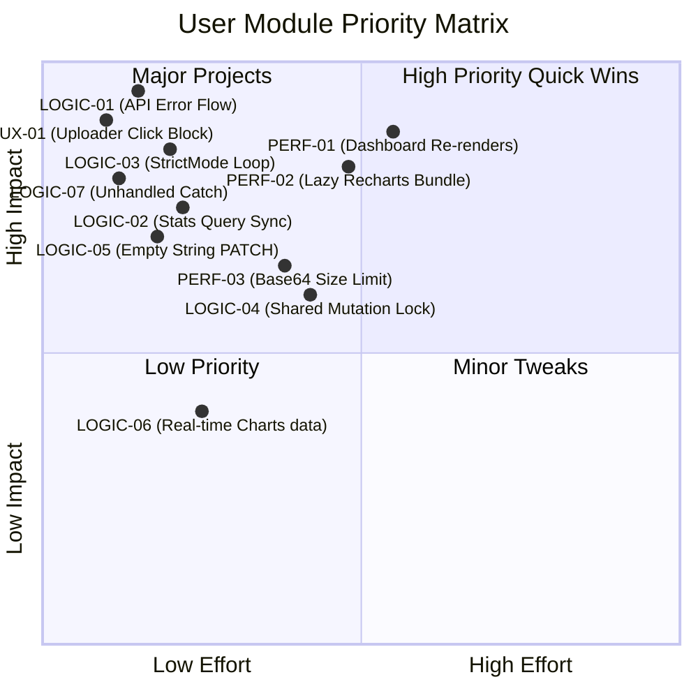

# User Module — Analysis Report

> **Scope:** `src/modules/user/`
> **Files analyzed:** `api/user.api.ts`, `services/user.service.ts`, `hooks/useUser.hook.ts`, `hooks/useUserFilters.hook.ts`, `components/forms/AvatarUploader.tsx`, `components/forms/EditUserModal.tsx`, `components/forms/UserForm.tsx`, `components/pages/AdminDashboardPage.tsx`, `components/pages/AdminUsersPage.tsx`, `components/pages/ProfileSettingsPage.tsx`, `components/pages/RegisterPage.tsx`, `components/pages/VerifyEmailPage.tsx`, `components/ui/UserFilters.tsx`, `components/ui/UserListTable.tsx`, `components/ui/UserStatsCards.tsx`, `constants/user.constants.ts`, `types/user.types.ts`
> **Supporting context:** `app/helpers/globalRequest.ts`, `package.json`
> **Date:** 2026-05-29

---

## Table of Contents

1. [Executive Summary](#1-executive-summary)
2. [Issue Index](#2-issue-index)
3. [Detailed Issues & Fixes](#3-detailed-issues--fixes)
   - [PERF-01 — Inefficient Dashboard Re-rendering on Filter Changes](#perf-01)
   - [PERF-02 — Heavy Recharts Bundle Overhead in Main Client Chunk](#perf-02)
   - [PERF-03 — Large Base64 Payload Upload without Client-side Limits](#perf-03)
   - [LOGIC-01 — Missing `errors` Forwarding in `userRequest` (API Validation Silence in UI)](#logic-01)
   - [LOGIC-02 — Missing Stats Cache Invalidation on User Updates (Stale Dashboard KPIs)](#logic-02)
   - [LOGIC-03 — Concurrency Failure in StrictMode on `VerifyEmailPage.tsx` (Double Invocation)](#logic-03)
   - [LOGIC-04 — Shared Mutation State UI Lock in `ProfileSettingsPage.tsx`](#logic-04)
   - [LOGIC-05 — Empty String Falsy Bug in `ProfileSettingsPage` Updates](#logic-05)
   - [LOGIC-06 — Hardcoded Demo Data in `AdminDashboardPage` Pie Chart](#logic-06)
   - [LOGIC-07 — Unhandled Exception Hazard in `EditUserModal.tsx`](#logic-07)
   - [UX-01 — Hidden Input Covers and Blocks Uploader "Remove Avatar" Button](#ux-01)
4. [Priority Matrix](#4-priority-matrix)
5. [Refactoring Roadmap](#5-refactoring-roadmap)

---

## 1. Executive Summary

The `user` module manages critical user capabilities, authentication-related profile settings, and administrative dashboards. Built on **Next.js 16**, **React 19**, **Zustand**, and **TanStack React Query**, the module implements modern state management and clean feature encapsulation.

However, an in-depth audit of its components, caching hooks, event handlers, and data transport layers revealed **11 performance, logic, and usability issues** that undermine application performance, stability, and UX.

### Key Discoveries:
1. **API Validation Silence (LOGIC-01):** The transport function `userRequest` in `user.api.ts` swallows the backend `errors` array during API validation failures, throwing a stripped-down object containing only `message` and `status`. Consequently, the field-level error highlight logic in `UserForm.tsx` is completely bypassed, displaying a generic, unhelpful error banner instead of highlighting the invalid inputs.
2. **Dashboard Re-render Lag (PERF-01 & PERF-02):** The heavy Recharts library is statically imported at the top-level of `AdminDashboardPage.tsx`. In addition, every keystroke or pagination click triggers client-side routing updates that force a full dashboard tree re-render. This forces Next.js to reconstruct the complex, unmemoized SVG charts repeatedly, causing visible rendering lag and high CPU usage.
3. **Double Verification Token Burn (LOGIC-03):** Under React StrictMode (development), `VerifyEmailPage.tsx` executes the email verification mutation twice on mount. Because email verification tokens are generally one-time-use, the second concurrent call fails, resulting in a sudden transition from "Verifying" to "Verification Failed" despite a successful first attempt.
4. **Interactive Overlap & UI Block (UX-01):** The `<input type="file">` element in `AvatarUploader.tsx` is styled with `absolute inset-0` with no relative styling or z-index prioritization. Because it sits later in the DOM tree, it covers the absolute-positioned "Delete Avatar" button. When users attempt to click the delete icon to remove their avatar, they instead click the hidden input, triggering the browser's file uploader modal.

Resolving these findings will eliminate rendering bottlenecks, fix silent form validations, secure robust email verification, and provide a premium, bug-free dashboard experience.

---

## 2. Issue Index

| ID | Severity | Category | Title |
|---|---|---|---|
| **PERF-01** | 🟡 Medium | Performance | Inefficient Dashboard Re-rendering on Filter Changes |
| **PERF-02** | 🟡 Medium | Performance | Heavy Recharts Bundle Overhead in Main Client Chunk |
| **PERF-03** | 🟡 Medium | Performance | Large Base64 Payload Upload without Client-side Limits |
| **LOGIC-01** | 🔴 High | Logic | Missing `errors` Forwarding in `userRequest` (API Validation Silence) |
| **LOGIC-02** | 🔴 High | Logic | Missing Stats Cache Invalidation on User Updates (Stale KPIs) |
| **LOGIC-03** | 🔴 High | Logic | Concurrency Failure in StrictMode on `VerifyEmailPage.tsx` |
| **LOGIC-04** | 🟡 Medium | Logic | Shared Mutation State UI Lock in `ProfileSettingsPage.tsx` |
| **LOGIC-05** | 🟡 Medium | Logic | Empty String Falsy Bug in `ProfileSettingsPage` Updates |
| **LOGIC-06** | 🟢 Low | Logic | Hardcoded Demo Data in `AdminDashboardPage` Pie Chart |
| **LOGIC-07** | 🔴 High | Logic | Unhandled Exception Hazard in `EditUserModal.tsx` |
| **UX-01** | 🔴 High | Usability / UI | Hidden Input Covers and Blocks Uploader "Remove Avatar" Button |

---

## 3. Detailed Issues & Fixes

### PERF-01

**Inefficient Dashboard Re-rendering on Filter Changes**

**File:** [`src/modules/user/components/pages/AdminDashboardPage.tsx`](../src/modules/user/components/pages/AdminDashboardPage.tsx#L269-L362)

**Description:**
The administrative dashboard renders a live user list table alongside static KPIs, quick actions, and multiple Recharts graphs. The dashboard state depends on standard URL query parameters fetched via `useUserFilters()`:

```tsx
export function AdminDashboardPage() {
  const [editingUser, setEditingUser] = useState<User | null>(null);
  const { page, search, role, status, updateFilter } = useUserFilters();
  
  // Changing filters forces the entire AdminDashboardPage to re-render!
  const { data: usersData, isLoading: usersLoading } = useUsers(filters);
  ...
```

Whenever the admin searches for a user, paginates, or toggles filters, the route parameters change, causing `useUserFilters` to trigger a full page re-render. Since `QuickActionsSection`, `KPIsSection`, and `ChartsSection` are standard unmemoized React components declared in the same scope, they are entirely reconstructed. Recharts components are computationally heavy to render because they build complex SVG nodes, leading to visible stuttering during search typing.

**Fix:**
Memoize static and non-state-dependent layout sections using `React.memo` or extract the user filtering and table into its own self-contained sub-component to isolate re-renders.

```tsx
// Wrap heavy/static sections in React.memo to skip render when parent state changes
const MemoizedChartsSection = React.memo(ChartsSection);
const MemoizedKPIsSection = React.memo(KPIsSection);
const MemoizedQuickActionsSection = React.memo(QuickActionsSection);

// Usage in AdminDashboardPage:
<MemoizedQuickActionsSection />
<MemoizedKPIsSection />
<MemoizedChartsSection />
```

---

### PERF-02

**Heavy Recharts Bundle Overhead in Main Client Chunk**

**File:** [`src/modules/user/components/pages/AdminDashboardPage.tsx`](../src/modules/user/components/pages/AdminDashboardPage.tsx#L16-L30)

**Description:**
The Recharts charting package is a massive library that accounts for a substantial chunk of the client-side bundle size. In `AdminDashboardPage.tsx`, Recharts components are imported statically at the top of the file:

```tsx
import {
  AreaChart,
  Area,
  BarChart,
  Bar,
  PieChart,
  Pie,
  Cell,
  ...
} from "recharts";
```

Because this page is a client component, these heavy third-party components are compiled directly into the main route chunk, slowing down the Initial Page Load (FCP / LCP) for administrators. Furthermore, Recharts does not natively support server rendering, which can trigger hydration mismatch warnings on the server.

**Fix:**
Dynamically import the charts component with next-generation dynamic imports (`next/dynamic`) and disable Server-Side Rendering (`ssr: false`) to move Recharts into a lazy-loaded chunk.

```tsx
import dynamic from "next/dynamic";

const LazyChartsSection = dynamic(
  () => import("./sections/ChartsSection").then((mod) => mod.ChartsSection),
  {
    ssr: false,
    loading: () => (
      <div className="h-[520px] w-full rounded-xl bg-gray-100 animate-pulse flex items-center justify-center text-text-muted">
        Loading Analytics Dashboard...
      </div>
    ),
  }
);
```

---

### PERF-03

**Large Base64 Payload Upload without Client-side Limits**

**File:** [`src/modules/user/components/pages/ProfileSettingsPage.tsx`](../src/modules/user/components/pages/ProfileSettingsPage.tsx#L29-L38)

**Description:**
In `ProfileSettingsPage.tsx`, the avatar upload mechanism reads raw files selected by the user and encodes them directly to a Base64 string inside the browser:

```tsx
const handleAvatarUpload = async (file: File): Promise<string> => {
  const base64 = await new Promise<string>((resolve, reject) => {
    const reader = new FileReader();
    reader.onload = () => resolve(reader.result as string);
    reader.onerror = reject;
    reader.readAsDataURL(file);
  });
  const updated = await mutateAsync({ avatar: base64 });
  return updated?.avatar ?? user?.avatar ?? "";
};
```

Base64 encoding increases file payload sizes by approximately 33%. If a user uploads a high-resolution, uncompressed 5MB image from their smartphone, the client attempts to transmit a massive ~6.7MB string inside a JSON PATCH request body. This causes noticeable network lag, high memory consumption, and easily hits backend proxy upload limits (such as Nginx `client_max_body_size` or Cloudflare's 100MB body limit), yielding sudden `413 Payload Too Large` failures.

**Fix:**
Add client-side size restrictions (e.g. max 2MB) and prompt the user if they exceed it, or compress/resize the image using a canvas helper prior to Base64 generation.

```tsx
const MAX_AVATAR_SIZE = 2 * 1024 * 1024; // 2MB limit

const handleAvatarUpload = async (file: File): Promise<string> => {
  if (file.size > MAX_AVATAR_SIZE) {
    toast.error("Avatar image must be smaller than 2MB.");
    throw new Error("File exceeds maximum size limits");
  }
  // Proceed with safe, small Base64 conversion...
};
```

---

### LOGIC-01

**Missing `errors` Forwarding in `userRequest` (API Validation Silence in UI)**

**File:** [`src/modules/user/api/user.api.ts`](../src/modules/user/api/user.api.ts#L17-L27)

**Description:**
`globalRequest` is a highly robust core request helper. When the backend rejects a payload (such as status `400 Bad Request` for a duplicate email or a weak password), the backend returns a structured error mapping under `errors`. `globalRequest` correctly captures these errors and returns:

```typescript
return {
  success: false,
  message: result?.message || result?.error || defaultErrorMessage,
  statusCode: response.status,
  errors: result?.errors, // Field-specific error details mapped here
};
```

However, the wrapper `userRequest` inside `user.api.ts` maps this response to a custom throw object but **completely omits the `errors` object**:

```typescript
// ❌ Current — throws only message and status
async function userRequest<TResult = any>(
  endpoint: string,
  method: "GET" | "POST" | "PATCH" | "PUT" | "DELETE" = "GET",
  body?: unknown,
): Promise<TResult> {
  const res = await globalRequest({ endpoint, method, body });
  if (!res.success) {
    throw { message: res.message, status: res.statusCode };
  }
  return res.data as TResult;
}
```

Because `errors` is stripped from the thrown exception, any call to `onSubmit(formData)` inside `UserForm.tsx` will receive an exception where `apiErr.errors` is `undefined`. The form is forced to bypass field highlighting and show a fallback generic banner:

```tsx
// UserForm.tsx - apiErr.errors is ALWAYS undefined
} catch (err: unknown) {
  const apiErr = err as ApiError;
  if (apiErr.errors) {
    // This block is completely unreachable!
    const fieldErrors: FormErrors = {};
    ...
  } else {
    // Falls back to generic banner, failing to tell the user which field is wrong
    setFormError(message);
  }
}
```

**Fix:**
Ensure `userRequest` forwards the parsed validation `errors` mapping so form field validation highlights operate perfectly.

```typescript
// ✅ Fix — Forward errors object through the exception
async function userRequest<TResult = any>(
  endpoint: string,
  method: "GET" | "POST" | "PATCH" | "PUT" | "DELETE" = "GET",
  body?: unknown,
): Promise<TResult> {
  const res = await globalRequest({ endpoint, method, body });
  if (!res.success) {
    throw { 
      message: res.message, 
      status: res.statusCode, 
      errors: res.errors // Forward details!
    };
  }
  return res.data as TResult;
}
```

---

### LOGIC-02

**Missing Stats Cache Invalidation on User Updates (Stale Dashboard KPIs)**

**File:** [`src/modules/user/hooks/useUser.hook.ts`](../src/modules/user/hooks/useUser.hook.ts#L59-L74)

**Description:**
The administrative dashboard displays KPI stats cards showing the number of admins, verified users, and unverified users fetched via `useUserStats()`. 

When an admin updates a user (such as changing a user's role to Admin or banning/deactivating an account) via `useUpdateUser`, the mutation's `onSuccess` handler invalidates `lists` and `details` queries, but **completely neglects** to invalidate `stats` queries:

```typescript
// ❌ Current onSuccess logic in useUpdateUser
onSuccess: () => {
  queryClient.invalidateQueries({ queryKey: userKeys.lists() });
  if (id !== undefined) {
    queryClient.invalidateQueries({ queryKey: userKeys.detail(id) });
  }
},
```

Consequently, the dashboard's KPI statistics cards will display stale data. For example, if a user is promoted to `admin`, the "Admins" counter will remain unchanged until the admin does a full page refresh or the query's 60-second `staleTime` expires.

**Fix:**
Add `userKeys.stats()` to the list of invalidated query keys inside `useUpdateUser` onSuccess.

```typescript
// ✅ Fix — Invalidate user stats alongside lists and details
onSuccess: () => {
  queryClient.invalidateQueries({ queryKey: userKeys.lists() });
  queryClient.invalidateQueries({ queryKey: userKeys.stats() }); // Restores live KPI sync!
  if (id !== undefined) {
    queryClient.invalidateQueries({ queryKey: userKeys.detail(id) });
  }
},
```

---

### LOGIC-03

**Concurrency Failure in StrictMode on `VerifyEmailPage.tsx` (Double Invocation)**

**File:** [`src/modules/user/components/pages/VerifyEmailPage.tsx`](../src/modules/user/components/pages/VerifyEmailPage.tsx#L15-L24)

**Description:**
`VerifyEmailPage.tsx` handles verification token submission inside a `useEffect` trigger:

```tsx
useEffect(() => {
  if (!token) {
    setStatus("failure");
    return;
  }

  mutateAsync({ token })
    .then(() => setStatus("success"))
    .catch(() => setStatus("failure"));
}, [token, mutateAsync]);
```

Under React 18+ & React 19's StrictMode, `useEffect` executes **twice** on initial mount in development environments. This initiates two concurrent verification API calls with the same token. 

Because secure backend systems invalidate verification tokens immediately upon first consumption (non-idempotent operation), the first request succeeds while the second, parallel request fails with a `"Token already used"` or `"Invalid token"` error. The failed second request overrides the first request's success state, immediately transitioning the user to the "Verification Failed" screen, causing high developer confusion and false negatives.

**Fix:**
Introduce a local flag using a `useRef` to track whether verification has already started and block duplicate, concurrent executions.

```tsx
const verificationStarted = useRef(false);

useEffect(() => {
  if (!token || verificationStarted.current) return;
  
  verificationStarted.current = true;
  setStatus("loading");

  mutateAsync({ token })
    .then(() => setStatus("success"))
    .catch(() => setStatus("failure"));
}, [token, mutateAsync]);
```

---

### LOGIC-04

**Shared Mutation State UI Lock in `ProfileSettingsPage.tsx`**

**File:** [`src/modules/user/components/pages/ProfileSettingsPage.tsx`](../src/modules/user/components/pages/ProfileSettingsPage.tsx#L19-L76)

**Description:**
`ProfileSettingsPage.tsx` renders two distinct forms: one for uploading an avatar (`AvatarUploader`) and one for editing personal profile details (`UserForm`). 

Both sub-components consume and depend on the exact same mutation instance's `isPending` state derived from `useUpdateUser(id)`:

```tsx
const { mutateAsync, isPending } = useUpdateUser(id);
...
<UserForm
  mode="edit"
  initialData={user}
  onSubmit={handleSubmit}
  isLoading={isPending} // Shared loading status!
/>
```

When the user uploads an avatar via `handleAvatarUpload`, it invokes `mutateAsync({ avatar: base64 })`. Because the mutation is shared, the `isPending` state becomes `true`, which forces the personal info `UserForm` to display a saving spinner and disable all text fields. This is highly disruptive UX, as uploading an avatar should never disable the text profile fields.

**Fix:**
Create separate mutation instances for avatar updates and personal information updates, or track upload loading state locally to decouple form fields.

```tsx
// ✅ Fix — Separate mutations to isolate pending states
const { mutateAsync: updateProfileDetails, isPending: isUpdatingDetails } = useUpdateUser(id);
const { mutateAsync: updateAvatarImage, isPending: isUploadingAvatar } = useUpdateUser(id);

// Usage:
<AvatarUploader onUpload={handleAvatarUpload} isLoading={isUploadingAvatar} />
<UserForm onSubmit={handleSubmit} isLoading={isUpdatingDetails} />
```

---

### LOGIC-05

**Empty String Falsy Bug in `ProfileSettingsPage` Updates**

**File:** [`src/modules/user/components/pages/ProfileSettingsPage.tsx`](../src/modules/user/components/pages/ProfileSettingsPage.tsx#L21-L27)

**Description:**
The submission handler for updating profile settings attempts to selectively construct the PATCH payload based on input value presence:

```typescript
const handleSubmit = async (data: UpdateUserDto) => {
  const payload: UpdateUserDto = {};
  if (data.name) payload.name = data.name;
  if (data.email) payload.email = data.email;
  if (data.password) payload.password = data.password;
  await mutateAsync(payload);
};
```

If a user decides to clear their optional `name` field entirely, the form passes an empty string `""` as `data.name`. 
Because an empty string is falsy (`""` evaluates to `false` in `if (data.name)`), the `name` field is completely excluded from the constructed `payload`. The request sent to the server contains no `name` key, and the server retains the user's previous name, making it impossible to clear or delete names.

**Fix:**
Check for field presence using explicit `undefined` checks or check typeof value to preserve empty strings when clearing fields.

```typescript
const handleSubmit = async (data: UpdateUserDto) => {
  const payload: UpdateUserDto = {};
  if (data.name !== undefined) payload.name = data.name; // Preserves empty string ""
  if (data.email !== undefined) payload.email = data.email;
  if (data.password) payload.password = data.password;
  await mutateAsync(payload);
};
```

---

### LOGIC-06

**Hardcoded Demo Data in `AdminDashboardPage` Pie Chart**

**File:** [`src/modules/user/components/pages/AdminDashboardPage.tsx`](../src/modules/user/components/pages/AdminDashboardPage.tsx#L84-L87)

**Description:**
`AdminDashboardPage` successfully requests and fetches real system metrics using `useUserStats()`, which returns counts like `adminsNumber`, `verifiedUsersNumber`, and `unverifiedUsersNumber`. 

However, the "User Role Distribution" Pie Chart inside `ChartsSection` completely ignores this live statistic, using a static, hardcoded placeholder array:

```typescript
const ROLE_DISTRIBUTION = [
  { name: "Admin", value: 15, color: "#0070dc" }, // Hardcoded static dummy value!
  { name: "User", value: 85, color: "#00b8db" },  // Hardcoded static dummy value!
];
```

This presents deceptive analytics to administrators who see static dashboard ratios regardless of actual user counts.

**Fix:**
Construct `ROLE_DISTRIBUTION` dynamically inside `AdminDashboardPage` or pass `stats` down as a prop to `ChartsSection` to dynamically build charts.

```tsx
// ✅ Fix — Build dynamic chart data based on real stats
const roleDistribution = stats ? [
  { name: "Admin", value: stats.adminsNumber, color: "#0070dc" },
  { name: "User", value: (stats.verifiedUsersNumber + stats.unverifiedUsersNumber) - stats.adminsNumber, color: "#00b8db" }
] : [];
```

---

### LOGIC-07

**Unhandled Exception Hazard in `EditUserModal.tsx`**

**File:** [`src/modules/user/components/forms/EditUserModal.tsx`](../src/modules/user/components/forms/EditUserModal.tsx#L24-L33)

**Description:**
The save handler inside the admin's `EditUserModal` is asynchronous and triggers `updateUser` from the mutation hook:

```tsx
const handleSave = async () => {
  await updateUser({
    name: name || undefined,
    email,
    avatar: avatar || undefined,
    role,
    status,
  });
  onClose();
};
```

This async execution is not wrapped inside a `try...catch` block. If the API returns a validation error or database conflict (e.g. status `409 Conflict` because the updated email is already taken by another user), the promise rejects. Because there is no error handler, a fatal unhandled promise rejection is thrown into the React render thread, triggering a crash or forcing the entire app into a generic Error Boundary. Additionally, the modal is immediately closed, hiding the issue from the administrator.

**Fix:**
Wrap the save function in a standard `try...catch` block and trigger error feedback (e.g. using `sonner` toasts) while keeping the modal open to let the admin correct inputs.

```tsx
import { toast } from "sonner";

const handleSave = async () => {
  try {
    await updateUser({
      name: name || undefined,
      email,
      avatar: avatar || undefined,
      role,
      status,
    });
    toast.success("User updated successfully");
    onClose();
  } catch (error: any) {
    toast.error(error?.message || "Failed to update user. Please try again.");
  }
};
```

---

### UX-01

**Hidden Input Covers and Blocks Uploader "Remove Avatar" Button**

**File:** [`src/modules/user/components/forms/AvatarUploader.tsx`](../src/modules/user/components/forms/AvatarUploader.tsx#L53-L101)

**Description:**
The uploader renders a visually appealing drop zone. When an image is present, it displays a preview with a small absolute-positioned "X" delete button to clear it:

```tsx
{preview ? (
  <div className="relative">
    
    <button
      type="button"
      onClick={handleRemovePreview}
      className="absolute -top-1 -right-1 rounded-full bg-red-500 ..."
    >
      <FiX className="size-3" />
    </button>
  </div>
) : ( ... )}

<input
  type="file"
  accept="image/*"
  onChange={handleInputChange}
  className="absolute inset-0 cursor-pointer opacity-0" // ❌ Covers entire parent container
  disabled={isUploading}
/>
```

Because the `<input>` element has `absolute inset-0` styling, is placed at the end of the DOM hierarchy, and lacks absolute layering context (`z-index`), it sits physically on top of the "X" remove button. 
When the user clicks the "X" button to clear the avatar, the browser event is captured by the invisible file input instead, launching the file uploader dialog and making it impossible for the user to delete or reset their avatar!

**Fix:**
Assign a high z-index and click propagation management to the delete button, or change the hidden file input's pointer events so it doesn't intercept actions intended for other buttons.

```tsx
// ✅ Fix — Place delete button on a higher layout layer
<button
  type="button"
  onClick={(e) => {
    e.stopPropagation(); // Stop bubble triggers
    handleRemovePreview();
  }}
  className="absolute -top-1 -right-1 z-20 rounded-full bg-red-500 p-1 text-white shadow hover:bg-red-600 transition-colors"
>
  <FiX className="size-3" />
</button>
```

---

## 4. Priority Matrix

By grouping these findings according to their overall impact and complexity, we establish a structured implementation plan:



---

## 5. Refactoring Roadmap

### Phase 1: High Priority Stability & UX Fixes (Immediate)
- **LOGIC-01 (API Error Flow):** Update `userRequest` in `user.api.ts` to include `errors: res.errors` in the thrown error object, resolving silent form validations immediately.
- **UX-01 (Uploader click block):** Add `z-20` and `e.stopPropagation()` to the delete button in `AvatarUploader.tsx`.
- **LOGIC-03 (Double verify token burn):** Wrap `VerifyEmailPage.tsx` verify triggers in a `useRef` guard to secure StrictMode safety.
- **LOGIC-07 (Edit Modal crashes):** Add `try...catch` blocks and `sonner` toasts around `handleSave` in `EditUserModal.tsx`.

### Phase 2: React Query Cache & Field Validation Fixes (Next Sprint)
- **LOGIC-02 (Dashboard KPI sync):** Add `userKeys.stats()` invalidation inside `useUpdateUser` hook onSuccess handler.
- **LOGIC-05 (Name clearing):** Shift to `!== undefined` payload validation inside `ProfileSettingsPage.tsx` to restore empty string updates.
- **LOGIC-04 (Decoupled Profile Settings):** Instantiate distinct updates mutations inside `ProfileSettingsPage.tsx` to stop personal form fields locking during avatar uploads.
- **LOGIC-06 (Real statistics charts):** Populate the role distribution Recharts pie chart using real fetched numbers from `useUserStats()`.

### Phase 3: Performance & Bundle Optimizations (Final Phase)
- **PERF-02 (Dynamic imports):** Move the heavy Recharts code blocks into a standalone chunk using Next.js `dynamic()` lazy loader.
- **PERF-01 (Skip duplicate rendering):** Wrap static dashboard components (`QuickActionsSection`, `KPIsSection`) and `ChartsSection` in `React.memo` to shield them from query filter re-renders.
- **PERF-03 (Uploader Payload protection):** Intercept file inputs exceeding `2MB` at the boundary of `AvatarUploader` to protect network latency.
